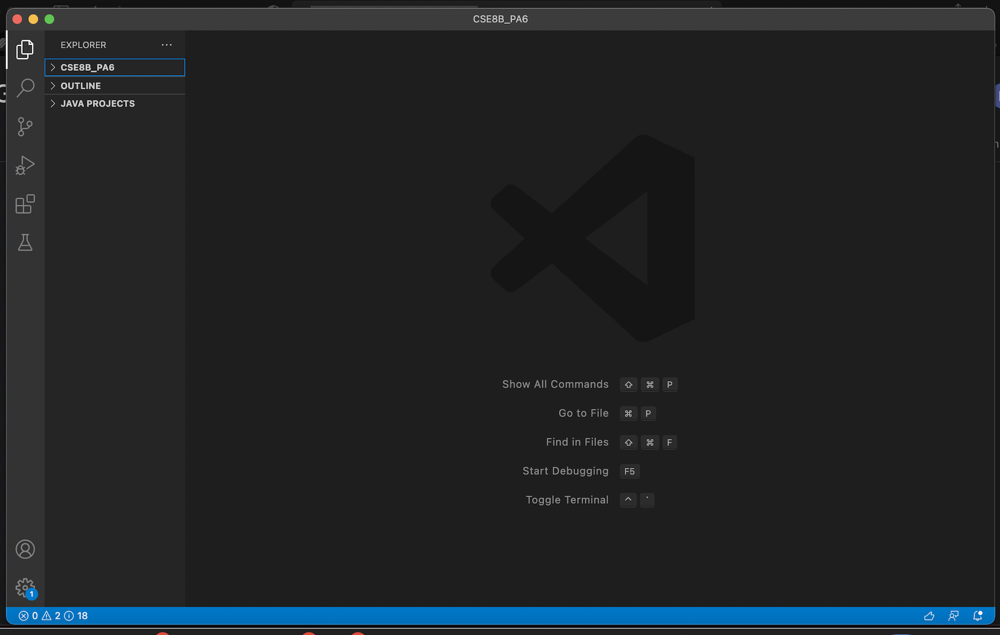
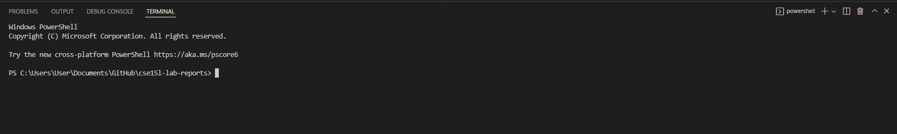
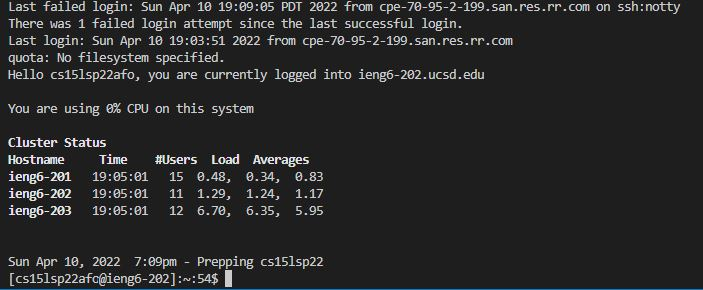
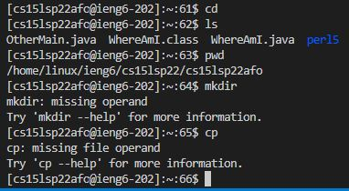
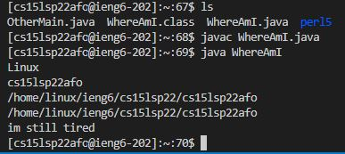
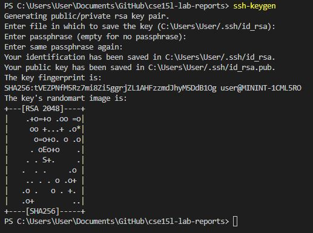
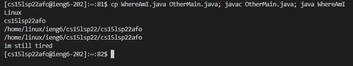

# Lab Report #1

A Tutorial on how to log into course-specific account on ieng6.

## Step 1: Install VScode

* Click on this [Link](https://code.visualstudio.com) and then follow the download instructions and install it on your computer.

* When you successfully install VScode, you should get something that looks like this:

## Step 2: Remotely Connecting

In order to remotely connection to your ieng6 account, you will have to use SSH (Secure Shell). 

* If you are using windows you will have to install [OpenSSH](https://docs.microsoft.com/en-us/windows-server/administration/openssh/openssh_install_firstuse).

* Then look for your course-specific account using ieng6 [here](https://sdacs.ucsd.edu/cgi-bin/alloc-query).

* In VScode, open up the terminal (Ctrl + \` (Windows), Ctrl + \` (Mac) or click on Terminal -> New Terminal)

* The terminal on VSCode should look like this:

* In the terminal, type out:
> ssh [Your ieng6 account]

Example:
> ssh cs15lsp22afo@ieng6.ucsd.edu

* A message will pop up looking something like this:
> The authenticity of host 'ieng6.ucsd.edu (128.54.70.238)' can't be established.
>
> RSA key fingerprint is SHA256:ksruYwhnYH+sySHnHAtLUHngrPEyZTDl/1x99wUQcec.
>
> Are you sure you want to continue connecting (yes/no)?

* Type yes and press enter. You will then be prompted to type in your password. After succesfully entering the right password you will then connect to your ieng6 account. It shoud look like something like this:

You can log out of the remote computer by pressing Ctrl + D or run the command exit
## Step 3: Trying Some Commands
There are multiple commands that are the same as your current computer and the remote computer and there are some that are different!

Some commands you can try are:
* cd
* ls
* pwd
* mkdir
* cp

When trying out those commands, the terminal should look something like this:

## Step 4: Moving Files with scp
In this step, you will be learning how to transfer files to the remote computer. You will always use scp from the client (your computer not the remote computer).

* Create a file called WhereAmI.java and copy this into it:
> class WhereAmI {
>
>  public static void main(String[] args) {
>
>    System.out.println(System.getProperty("os.name"));
>
>    System.out.println(System.getProperty("user.name"));
>
>    System.out.println(System.getProperty("user.home"));
>
>    System.out.println(System.getProperty("user.dir"));
>
>  }
>
>}
* Take the file and type out:
> scp WhereAmI.java [Your ieng6 account]

Example:
> scp WhereAmI.java cs15lsp22afo@ieng6.ucsd.edu

* You will then be prompted to type out your password just like when using the command ssh.

* Then log into your ieng6 account and try running the file using javac and java! It should look something like this:

## Part 6: Setting an SSH Key
As you may have noticed, it is quite tedious and annoying to constantly type in the password when trying to access the remote computer. SSH Keys can solve this problem by essentially completing the password process without you having to constantly type it.

* On the client (your computer not the remote computer) type out:
> ssh-keygen

* These messages should pop up:
> Generating public/private rsa key pair.
>
> Enter file in which to save the key (/Users/User/.ssh/id_rsa):

* Copy and paste this:
> /Users/\<user-name\>/.ssh/id_rsa

* The result should look like this:

* Then follow these steps:
>
> ssh cs15lsp22zz@ieng6.ucsd.edu
>
> \<Enter Password\>
>
> now on server
>
> mkdir .ssh
>
> exit
>
> back on client
>
> scp /Users/\<user-name\>/.ssh/id_rsa.pub [Your ieng6 account].edu:~/.ssh/authorized_keys
>
> \<Enter Password>\

* Now you should be able to quickly access the remote computer without having to type your password!

## Step 7: Optimizing Remote Running
You can type out some commands all in one line instead of having to do it in multiple lines! For example you can log into the remote computer and type out a command. In order to do this you will have to use semicolons at the end of each command.

Example:
> cp WhereAmI.java OtherMain.java; javac OtherMain.java; java WhereAmI

Typing out the command above will look like this:
