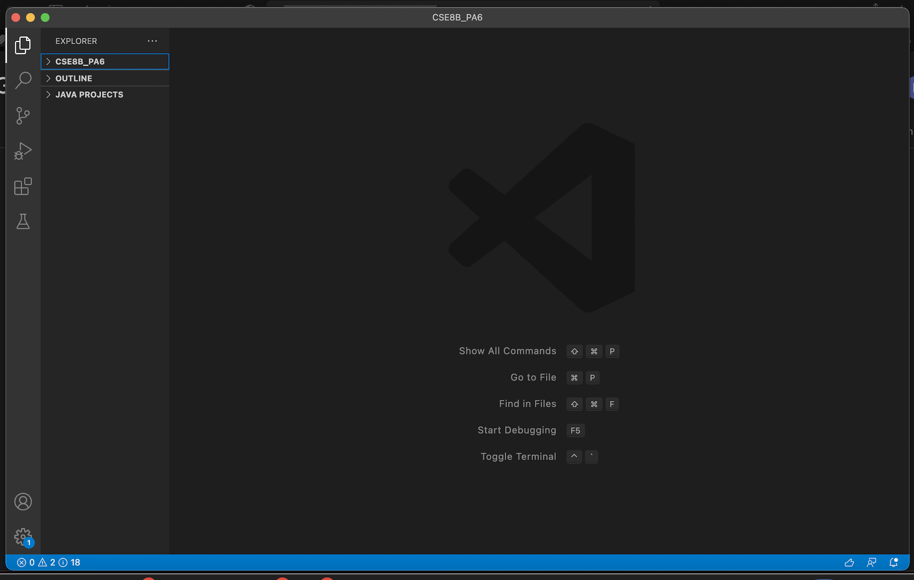

# Lab Report #1

A Tutorial on how to log into course-specific account on ieng6.

## Step 1: Install VScode

* Click on this [Link](https://code.visualstudio.com) and then follow the download instructions and install it on your computer.

* When you successfully install VScode, you should get something that looks like this:

## Step 2: Remotely Connecting

In order to remotely connection to your ieng6 account, you will have to use SSH (Secure Shell). 

* If you are using windows you will have to install [OpenSSH](https://docs.microsoft.com/en-us/windows-server/administration/openssh/openssh_install_firstuse).

* Then look for your course-specific account using ieng6 [here](https://sdacs.ucsd.edu/cgi-bin/alloc-query).

* In VScode, open up the terminal
