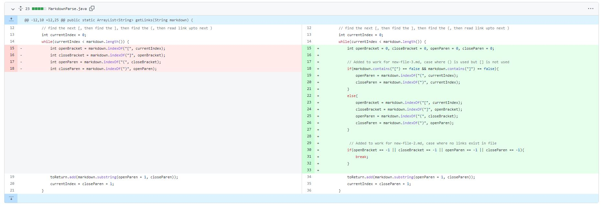
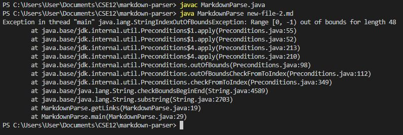
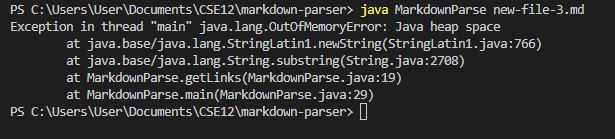
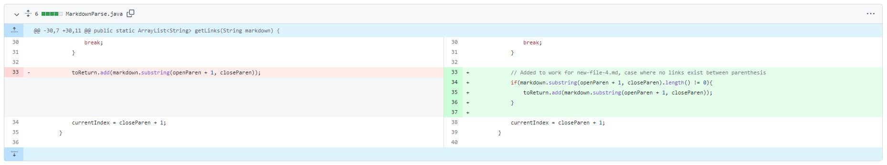
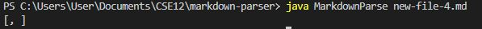

# Lab Report #2

### Code Change #1

The link below shows a test file where there are no links in the markdown file.

[*Failure-Inducing Test File*](https://github.com/Dahminh/markdown-parser/blob/main/new-file-2.md)

*Output of Failure-Inducing Input*

The output displayed is symptom as it shows the code failing to execute (index out of bounds error) due to the combination of a bug and a failure-inducing input. The failure-inducing input creates a bug because the code has logic errors when using the input. The code HAS to return add a string to the return ArrayList, resulting in this bug.

### Code Change #2

The link below shows a test file where there is a link in the markdown file but there are no brackets [].

[*Failure-Inducing Test File*](https://github.com/Dahminh/markdown-parser/blob/main/new-file-3.md)

*Output of Failure-Inducing Input*

The output displayed is a symptom as it shows the code failing to execute (an infinite loop) due to the combination of a bug and a failure-inducing input. The failure-inducing input creates a bug because the code has logic errors when using the input. The code is unable to find any square brackets, which prevents the code from running as intended.

### Code Change #3

The link below shows a test file where there is no link between the paranthesis in the markdown file.

[*Failure-Inducing Test File*](https://github.com/Dahminh/markdown-parser/blob/main/new-file-4.md)

*Output of Failure-Inducing Input*

The output displayed is a symptom as it shows the code returning the wrong output due to the combination of a bug and a failure-inducing input. The failure-inducing input creates a bug because the code includes what is between the paranethesis when there is nothing between the paranthesis. The code counts such empty space as a valid input and returns it.