# Lab Report #3

## Streamlining ssh Configuration

This is the .ssh/config file, edited using VScode.

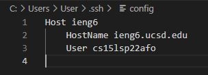

Logging into ssh with ieng6.

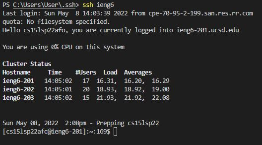

Using scp command using the ieng6 alias, copying WhereAmI.java to the ieng6 account.

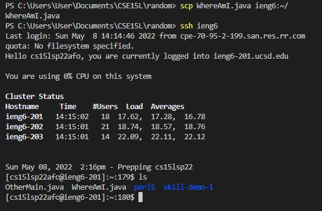

## Setup Github Actions from ieng6

Public Key stored on Github and ieng6 account. The private key is also stored in the same place as the public key on the ieng6 account.

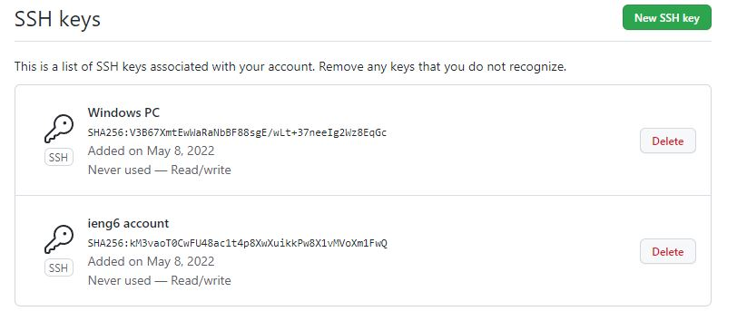

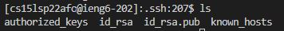

Ran git commands to commit and push a change to Github while logged into the ieng6 account.

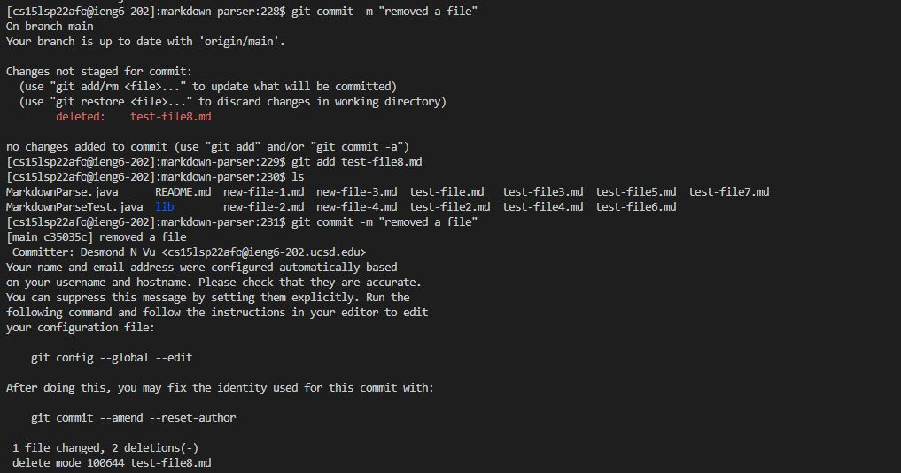

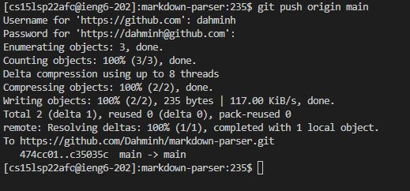

[Link to the resulting Commit](https://github.com/Dahminh/markdown-parser/commit/c35035c68b7f22e310e130ad0ecc8691808bb721)

## Copying Whole Directories with -scp r

Copied markdown-parser directory into ieng6 account.

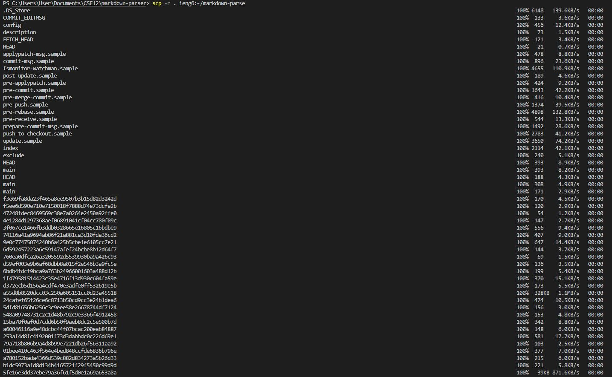

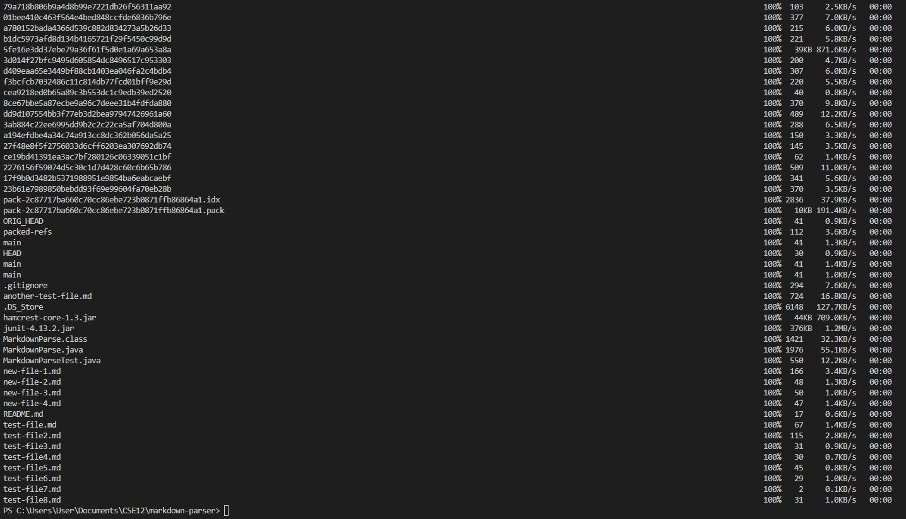

Compiled and ran the test on the ieng6 account.

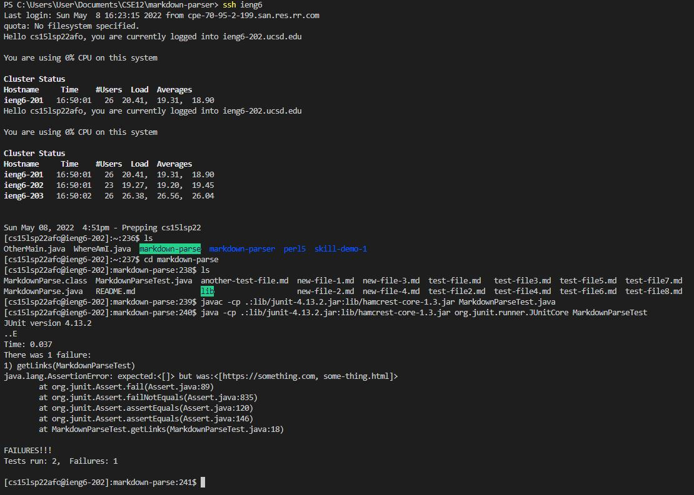

Combined multiple commands into one line.

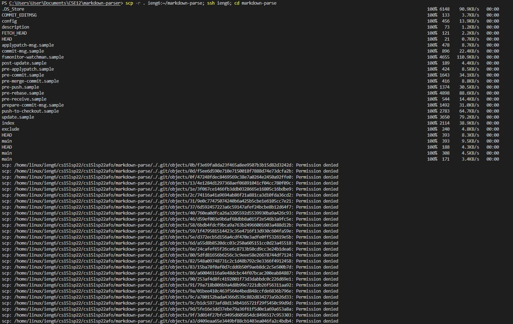

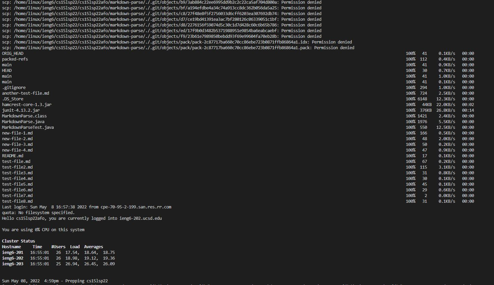

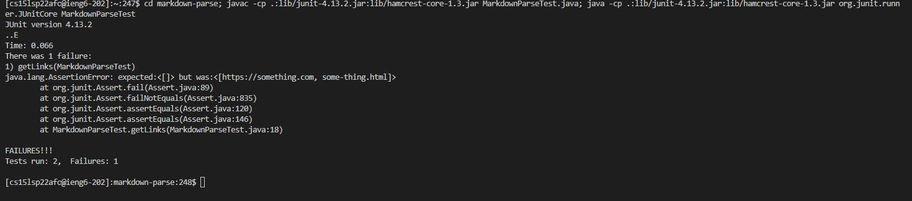