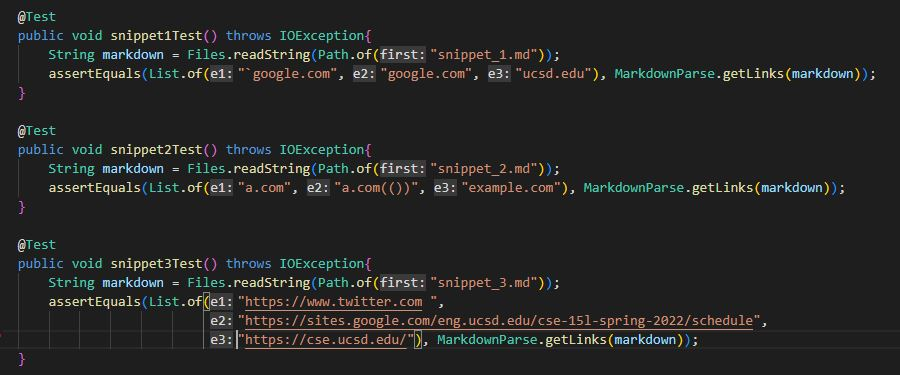
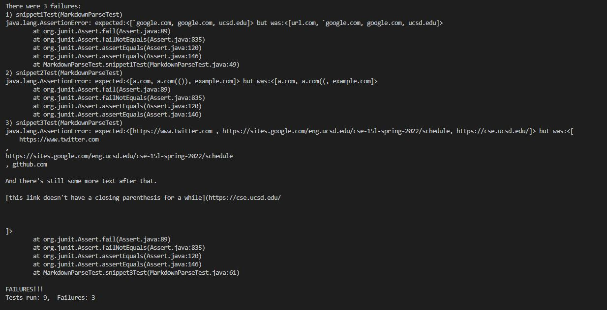
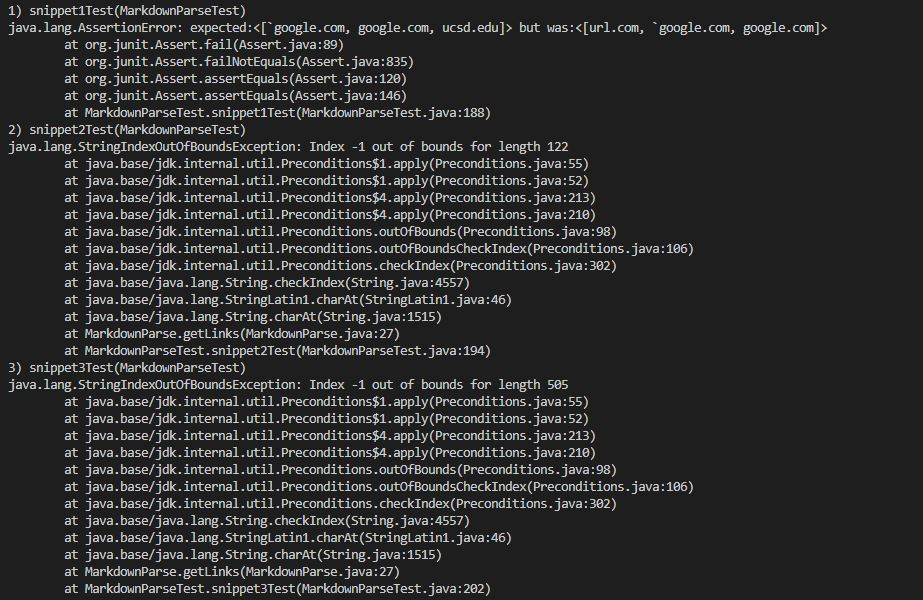

# Lab Report #4

[My Repository](https://github.com/Dahminh/markdown-parser)

[Reviewed Repositoy](https://github.com/TheJoeship/markdown-parser-fork)

Used VSCode to determine what counts as a link.

Showing the code in MarkdownParseTest.java for testing snippets.

My Implementation:

All Tests for Snippet failed.

Reviewed Implementation:

All Tests for Snipped failed.

Snippet 1:

It would be possible to make a small code change that would check if there is an inline code with backticks. This small code change could be done with an if statement and check if there is a backtick next to a bracket, if there is one, ignore this set of brackets, if there is not, find the corresponding link.

Snippet 2:

It would be possible to make a small code change that would check if there are nested parantheses, brackets, and escaped brackets. The code would require to check if there are any nested parantheses, brackets, and escaped brackets by using a while loop, determining where the corresponding ending parantheses and brackets are to the starting parantheses and brackets.

Snippet 3: 

It would be possible to make a small code change that would check if there are newlines in brackets and parentheses. This can be done by detecting where the corresponding ending bracket and parantheses to the starting bracket and paranthesis, perhaps by using an if statement.