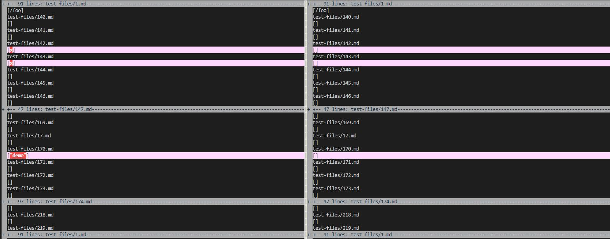
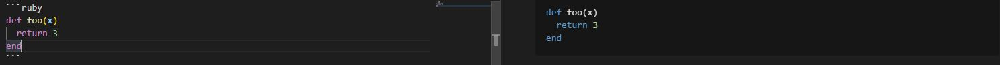
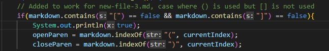
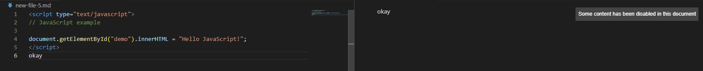

# Lab Report 5

Found the test with different results using vimdiff on the results of running a bash for loop.

[First test-file, 142.md](https://raw.githubusercontent.com/nidhidhamnani/markdown-parser/main/test-files/142.md)

My implementation of markdown parser is wrong and provided the wrong output. The provided implementation of markdown parser is correct by providing an empty list as the output. The output for my implementation outputted [x] while the provided implementation outputted []. The correct implementation is [].

The following is the markdown file and its preview. As you can see there are no valid links and therefore should have an empty list as an output in markdown parser.

In my code there is a feature that would count anything as a link as long as it is in between two valid paranthesis. Due to the fact that there are no brackets but only paranthesis in the markdown file, the x is counted as a valid link.

[Second test-file, 170.md](https://raw.githubusercontent.com/nidhidhamnani/markdown-parser/main/test-files/170.md)

My implementation of markdown parser is wrong and provided the wrong output. The provided implementation of markdown parser is correct by providing an empty list as the output. The output for my implementation outputted ["demo"] while the provided implementation outputted []. The correct implementation is [].

The following is the markdown file and its preview. As you can see there are no valid links and therefore should have an empty list as an output in markdown parser.

In my code there is a feature that would count anything as a link as long as it is in between two valid paranthesis. Due to the fact that there are no brackets but only paranthesis in the markdown file, the "demo" is counted as a valid link.

